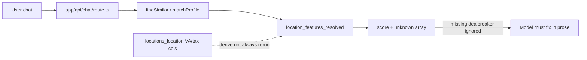

# Chat integrity and data-gap fix plan

Tracks work for GitHub issues #16, #17, and #18: chat presentation polish,
strict missing-dealbreaker matching, post-import feature derivation, and VA
facilities backfill.

Related: [PRODUCT.md](../PRODUCT.md), [ROADMAP.md](../ROADMAP.md),
[ALL_DATA_RETRIEVAL_INSTRUCTIONS.md](../../ALL_DATA_RETRIEVAL_INSTRUCTIONS.md).

## Coverage snapshot

### Before structural re-derive (Neon, 2026-08-07)

| Metric | Count |
| --- | ---: |
| Curated locations | 119 |
| Legacy VA both (`nearest_va` + `distance_to_va`) | 66 |
| Resolved `va_outpatient_access` | 62 |
| Resolved `va_hospital_access` | 2 |
| Resolved `street_life_vibrancy` | 8 |
| `sales_tax` / `income_tax` populated | 119 / 119 |
| `col_index` populated | 108 |
| Cities with zero profile features | 5 |

Zero-feature cities then: Bellevue WA, Boulder CO, Broomfield CO, Lake Forest CA,
Oklahoma City OK.

### After milestone 3 derive (same day)

| Metric | Count |
| --- | ---: |
| Cities with any profile features | 119 |
| Zero-feature cities | 0 |
| Resolved `va_outpatient_access` | 67 |

All five former zero-feature cities now have structural rows including
`va_outpatient_access` (Bellevue 0.833, Boulder 1.0, Broomfield 0.733,
Lake Forest 0.750, Oklahoma City 1.0).

Tax columns exist on every location; the city-profile ontology has no tax
trait, so chat ranking cannot honestly answer “low taxes” today.

## What breaks

Target: missing dealbreaker / `requireKnown` fails in code; prompt + UI stop
leaking internals.

## Issue split

| Issue | Database gap? | Chat/script gap? | Fix |
| --- | --- | --- | --- |
| #16 climate-refinement phrasing | No | Yes | Prompt rewrite |
| #17 tone / Markdown / status | No | Yes | Prompt + UI |
| #18 verified dealbreakers / proxies | Yes | Yes | Matcher + pipeline + VA backfill |

## Milestones

### 0 — This plan + issue linkage

- This document + ROADMAP pointer.
- Comments on #16, #17, #18.

### 1 — Strict missing dealbreakers (#18 code)

- `Preference.requireKnown`.
- `dealbreaker` or `requireKnown` + missing value → disqualify.
- Keep numeric dealbreaker when value exists and `miss > 0.25`.
- Result metadata: `scopeNote`; approved provenance terms only
  (`researched` / `computed`).
- CLI shares `matchProfileToCities` (no duplicated ranking logic).
- Vitest for verified-VA / requireKnown / non-dealbreaker unknown.
- Chat: “verified only” → `dealbreaker` + `requireKnown`; “low taxes” → decline
  (no tax ontology in this pass).

### 2 — Chat polish (#16 / #17)

- Climate refinement: honest scope without narrating tool re-reads.
- Human labels only in user-facing prose; no feature-key leaks.
- Markdown rendering; quieter tool status.

### 3 — Derive the five zero-feature cities

- Run `derive-structural-features.ts` (dry-run, then live).
- Require structural derivation in the post-import checklist.

### 4 — VA facilities refresh / backfill

- Typed outpatient vs hospital via VA Facilities API.
- Keep `nearest_va` / `distance_to_va` as outpatient-oriented inputs for
  `va_outpatient_access`.
- Derive `va_hospital_access` structurally from hospital distance when present;
  never treat clinic distance as hospital access.

## Deferred

- `tax_burden` / retiree after-tax feature (needs product definition).
- Broad editorial expansion of `street_life_vibrancy` (keep “not assessed”
  when unknown).

## Verification

- Vitest: strict dealbreaker / requireKnown cases pass.
- `/chat`: no “re-reading” meta; Markdown works; quiet tool chrome.
- `/chat`: verified-VA request excludes unknown-VA cities.
- `/chat`: low-taxes declines or clearly reframes affordability.
- Neon: five new cities have structural features; VA coverage updated.
- `npx tsc --noEmit` clean.
